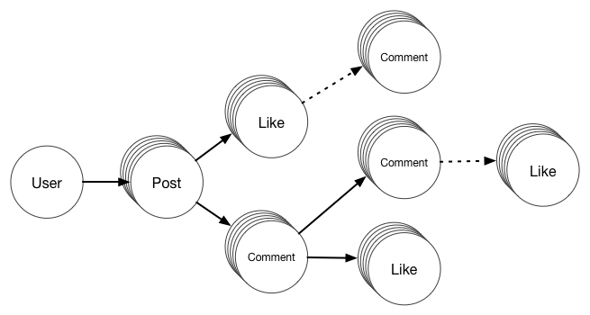

## Example Usage

Let's take a social backend as an example ([based on social.go](example/social/social.go))
- Users create posts
- Other users like Posts
- Other users comment on Posts
- Other users like the comments
- Other users comment on the comment (aka reply)
- (Extra) Other users like the comment on the comment
- (Extra) Other users comment on the like



A typical table for a Post would be like this:

##### POST
Column | Type | Description
--- | --- | ---
Id | string | Unique identifier of the post
VersionId | string | To identify edits to the post
Timestamp | time | Version creation time
Body | string | Content of the post
Url | string | Any urls shared
Image | blob | Any images shared
User | string | Author of the post
Privacy | int | Shared with self, friends or the world

##### Comment
Column | Type | Description
--- | --- | ---
Id | string | Unique identifier of the comment
VersionId | string | To identify edits to the comment
PostId | string | Id of parent post
CommentId | string | Id of parent comment
Timestamp | time | Version creation time
Body | string | Content of the comment
Url | string | Any urls shared
User | string | Author of the comment

and so on for **Like**. Then for each of these types, one would have to write functions to create, update, or delete these entities.
And while reading, one would have to join these tables to get the entire structured data. *All this would be a lot of effort on its own.*

### Instead, enter CRUD

*This is how various operations can be performed using gocrud library*
##### Create a new Post
```go
p := api.Get("User", userid).SetSource(userid).AddChild("Post")
p.Set("url", "www.google.com").Set("body", "You can search for cat videos here")
p.Set("tags", [arbitrary Go data]).Execute(ctx)
```

##### Like and Comment
```go
p := api.Get("Post", postid).SetSource(userid)
p.AddChild("Comment").Set("body", "Comment on the post")
p.AddChild("Like").Set("thumbsup", true).Execute(ctx)
```

##### Reply to comment
```go
c := api.Get("Comment", commentid).SetSource(userid)
c.AddChild("Comment").Set("body", "Comment on comment").Execute(ctx)
```

##### Comment on Like (*because we can, easily*)
```go
l := api.Get("Like", likeid).SetSource(userid)
l.AddChild("Comment").Set("body", "Nice that you like this").Execute(ctx)
```

##### Add some property `censored`
```go
api.Get("Comment", commentid).SetSource(uid).Set("censored", true).Execute(ctx)
```

##### Mark deleted
Something marked as deleted would never be retrieved.
```go
api.Get("Like", like.Id).SetSource(newUser()).MarkDeleted().Execute(ctx)
```

##### Read User
Now finally, read it all back
```go
q := api.NewQuery("User", uid).Collect("Post")
// Note that Collect() on a node would return child node query pointer,
// and run operations there.
q.Collect("Like").UptoDepth(10)
q.Collect("Comment").UptoDepth(10).FilterOut("censored")
result, err := q.Run(c)
js, err := result.ToJson()

// or directly to w http.ResponseWriter
result.WriteJsonResponse(w)
```

Sample result produced:
Full JSON
```json
{
    "Post": [
        {
            "Comment": [
                {
                    "Comment": [
                        {
                            "body": "Comment di on comment",
                            "id": "w0YDg",
                            "kind": "Comment",
                            "source": "uid_IxD",
                            "ts_millis": 1435373783693
                        }
                    ],
                    "Like": [
                        {
                            "Comment": [
                                {
                                    "body": "Comment j3 on Like",
                                    "id": "O1Kqv",
                                    "kind": "Comment",
                                    "source": "uid_avi",
                                    "ts_millis": 1435373783695
                                }
                            ],
                            "id": "PYuUz",
                            "kind": "Like",
                            "source": "uid_IxD",
                            "thumb": 1,
                            "ts_millis": 1435373783693
                        }
                    ],
                    "body": "Comment gI on the post",
                    "censored": true,
                    "id": "xcbbG",
                    "kind": "Comment",
                    "source": "uid_rfV",
                    "ts_millis": 1435373783696
                }
            ],
            "Like": [
                {
                    "id": "h5izf",
                    "kind": "Like",
                    "source": "uid_uQf",
                    "thumb": 1,
                    "ts_millis": 1435373783691
                },
                {
                    "id": "3P1RK",
                    "kind": "Like",
                    "source": "uid_Nab",
                    "thumb": 1,
                    "ts_millis": 1435373783692
                }
            ],
            "body": "You can search for cat videos here",
            "id": "6MV1v",
            "kind": "Post",
            "source": "uid_rWe",
            "tags": [
                "search",
                "cat",
                "videos"
            ],
            "ts_millis": 1435373783690,
            "url": "www.google.com"
        }
    ],
    "id": "uid_rWe",
    "kind": "User",
    "ts_millis": 0
}
```

JSON produced after removing node with `censored`, and the deleted nodes.
```json
{
    "Post": [
        {
            "Like": [
                {
                    "id": "3P1RK",
                    "kind": "Like",
                    "source": "uid_Nab",
                    "thumb": 1,
                    "ts_millis": 1435373783692
                }
            ],
            "body": "You can search for cat videos here",
            "id": "6MV1v",
            "kind": "Post",
            "source": "uid_rWe",
            "tags": [
                "search",
                "cat",
                "videos"
            ],
            "ts_millis": 1435373783690,
            "url": "www.google.com"
        }
    ],
    "id": "uid_rWe",
    "kind": "User",
    "ts_millis": 0
}
```

To see this in action, run this example:
```bash
go build example/social/social.go
./social

// Also a REST server
go build example/server/server.go
./server
```

These are fairly complex operations on fairly complex data structure,
CRUD for which would have been a lot of work to put together using typical
SQL / NoSQL table approach.


